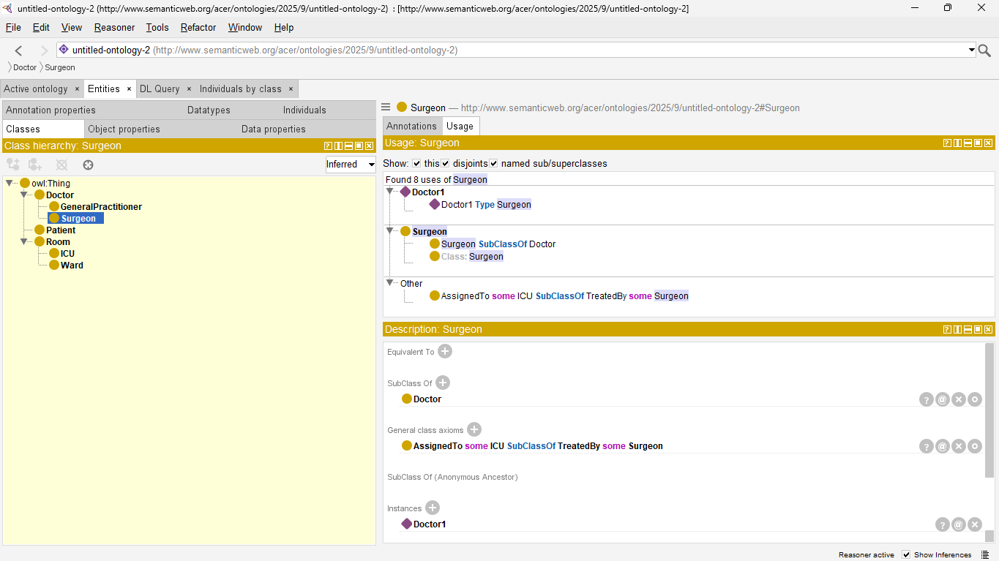
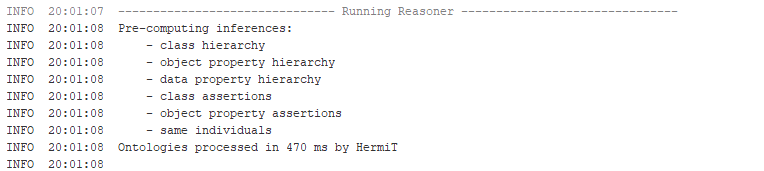

# rsbp-tugas-1

Gunakan Protégé untuk membangun sebuah ontologi pada domain yang Anda pilih (misalnya: perpustakaan, restoran, e-commerce, atau sistem akademik). Sertakan dokumentasi yang menjelaskan struktur ontologi Anda.

1. Tentukan dan definisikan minimal 3 kelas (classes) utama dalam domain Anda. Untuk setiap kelas, tambahkan minimal 2 instances.
- Doctor: Doctor1 dan Doctor2
- Patient: Patient1 dan Patient2
- Room: Room1 dan Room2

2. Definisikan minimal 3 properti objek (object properties) yang merepresentasikan relasi antar kelas (misalnya: “hasAuthor”, “isEnrolledIn”, “servesMenuItem”), lengkap dengan domain dan range yang tepat.
- Doctor Supervises Patient
- Patient AssignedTo Room
- Pantient TreatedBy Doctor

3. Definisikan minimal 2 properti data (data properties) yang menghubungkan individu dengan nilai-literal (misalnya: “hasISBN”, “yearPublished”, “menuItemPrice”).
- Patient hasAge (xsd:int) dan hasDiagnosis (xsd:string)
- Doctor hasSpecialization (xsd:string)
- Room hasRoomNumber (xsd:string)

4. Tambahkan hierarki kelas (subclass) minimal satu tingkat (misalnya: “Employee” subclass dari “Person”).
- Doctor: GeneralPractitioner (Doctor2) and Surgeon (Doctor1)
- Room: Ward (Room2) and ICU (Room1)

5.	Tambahkan setidaknya satu aturan atau axioma (misalnya: kelas A dan B tidak boleh memiliki individu yang sama, atau properti tertentu bersifat fungsi tunggal, atau kelas tertentu bersifat disjoint dengan kelas lainnya).
- Properties AssignedTo bersifat fungsional, sehingga Patient tidak bisa berada pada dua ruangan yang sama di waktu yang bersamaan
- Class ICU disjoint dengan Ward, karena fasilitas yang dimiliki oleh kedua ruangan tersebut berbeda.
- Penambahan “assignedTo some ICU SubClassOf treatedBy some Surgeon” pada General class axioms yang menandakan bahwa Patient yang masuk ke ruang ICU akan ditangani Surgeon

6.	OPSIONAL (bonus): Gunakan fitur reasoning (classifier) di Protégé untuk memeriksa apakah ontologi Anda konsisten dan apakah inferensi tambahan muncul (misalnya: seorang individu yang merupakan instance kelas “UndergraduateStudent” juga dapat dianalisis menjadi instance dari superclass “Student”). Sertakan hasil reasoning dalam dokumentasi Anda.

Proses reasoning dijalankan menggunakan HermiT dan tidak ditemukan error atau konflik pada inference dan hasil sesuai dengan axioma terutama pada penambahan untuk Surgeon yang harus menangani pasien di ICU.
